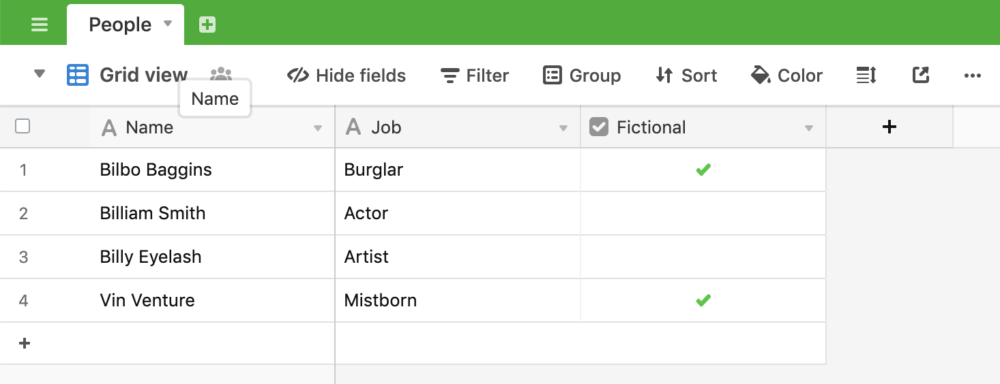

# Airtable Query Examples

## Project Overview

This project contains example endpoints that query data from an Airtable base. It uses the [airtable.query.select](https://autocode.com/stdlib/airtable/query/#select) API from Autocode's Standard Library. You can deploy your own working version of this project in just a few clicks with Autocode.

[](https://open.autocode.com/)

Click the button above to open this project in Autocode, and create a copy of the sample base on your own Airtable account by clicking this link: https://airtable.com/addBaseFromShare/shrcOc6fZARviMGeK. Then, link your copy of the base to your project in Autocode and deploy!



Like all Autocode templates, the endpoints and queries in this project are completely customizable –– everything is code that you can edit and test using the Autocode editor.

## Endpoints

These endpoints are accessible via HTTP. You can make calls to them via the [lib-js](https://github.com/stdlib/lib-js) frontend package, or directly to the URL using `fetch` or whatever HTTP client you prefer.

These endpoints use [KeyQL query](https://github.com/FunctionScript/KeyQL) to make queries. See the KeyQL Github repo for the spec and more examples: https://github.com/FunctionScript/KeyQL

### functions/contains.js

This endpoint is an example of a `contains` KeyQL query. It looks for rows in the linked Airtable base where the `Job` field contains the substring, `ist`. From the sample base, it returns:

```
[
  {
    "Job": "Mistborn",
    "Born On": "2006-07-17",
    "Fictional": true,
    "Name": "Vin Venture"
  },
  {
    "Job": "Scientist",
    "Born On": "1955-11-27",
    "Name": "Bill Nye",
    "Fictional": null
  },
  {
    "Job": "Artist",
    "Born On": "2001-12-18",
    "Name": "billy eyelash",
    "Fictional": null
  }
]
```

### functions/date__gt.js

This endpoint is an example of a `date__gt` KeyQL query. It looks for rows in the linked Airtable base where the `Born On` field is after `2000-01-01`. From the sample base, it returns:

```
[
  {
    "Job": "Mistborn",
    "Born On": "2006-07-17",
    "Fictional": true,
    "Name": "Vin Venture"
  },
  {
    "Job": "Artist",
    "Born On": "2001-12-18",
    "Name": "billy eyelash",
    "Fictional": null
  }
]
```

### functions/istartswith.js

This endpoint is an example of a `istartswith` KeyQL query. It looks for rows in the linked Airtable base where the `Name` field starts with the string `bil`, case insensitive. From the sample base, it returns:

```
[
  {
    "Job": "Scientist",
    "Born On": "1955-11-27",
    "Name": "Bill Nye",
    "Fictional": null
  },
  {
    "Job": "Artist",
    "Born On": "2001-12-18",
    "Name": "billy eyelash",
    "Fictional": null
  },
  {
    "Job": "Burglar",
    "Born On": "1937-09-21",
    "Fictional": true,
    "Name": "Bilbo Baggins"
  }
]
```

## Thank You!

Please check out [Autocode](https://autocode.com) or follow us on Twitter, [@AutocodeHQ](https://twitter.com/AutocodeHQ).
