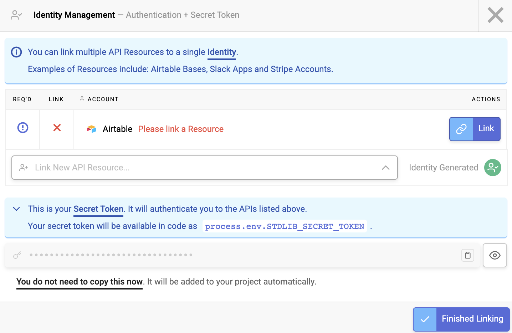
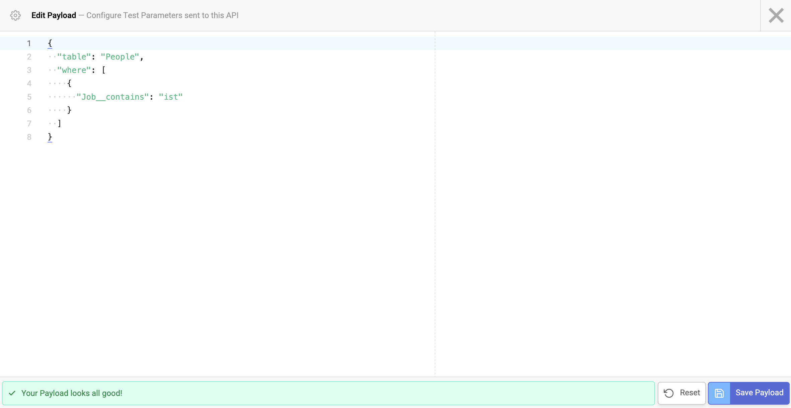
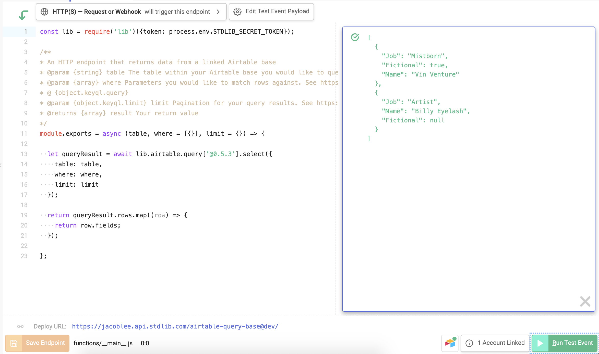

# Airtable Base Query Example

## Deploy Now

[](https://deploy.stdlib.com/)

This project contains an endpoint that queries data from an Airtable base as an authless API. It wraps the [airtable.query.select](https://autocode.com/stdlib/airtable/query/#select) API and makes the data available for frontend calls. You can deploy this API in just a few clicks onto Autocode by clicking the button above and linking your desired Airtable Base.

This behavior is completely customizable by editing the API code and redeploying. The only things you'll need are an Autocode account and an Airtable base!

## Making Queries

Your endpoint will be accessible via HTTP. You can make calls to it via the [lib-js](https://github.com/stdlib/lib-js) frontend package, or directly to the URL using `fetch` or whatever HTTP client you prefer.

Given an Airtable base with the following content:


Here are some examples and results of querying your base via this endpoint:

Via `lib-js`:
```
lib.username['airtable-query-base']['@dev']({
  table: 'People',
  where: [{
    Name__startswith: 'Bil'
  }]
}, (err, data) => {
  if (err) {
    // Handle error
  }
  console.log(data);
  /*
    Logs:
    [{
      Name: 'Bilbo Baggins',
      Job: 'Burglar',
      Fictional: true
    }, {
      Name: 'Billiam Smith',
      Job: 'Actor',
      Fictional: null
    }, {
      Name: 'Billy Eyelash',
      Job: 'Artist',
      Fictional: null
    }]
  */
});
```

Via `fetch`:
```
async function fetchData () {
  // You must provide the trailing slash in the URL
  let response = await fetch('https://username.api.stdlib.com/airtable-query-base@dev/', {
    method: 'POST',
    headers: {
      'Content-Type': 'application/json'
    },
    body: JSON.stringify({
      table: 'People',
      where: [{
        Job__contains: 'ist'
      }]
    })
  });
  return response.json();
  /*
    Returns:
    [{
      Name: 'Billy Eyelash',
      Job: 'Artist',
      Fictional: null
    }, {
      Name: 'Vin Venture',
      Job: 'Mistborn',
      Fictional: true
    }]
  */
}
```

The endpoint accepts [KeyQL query and limit parameters](https://github.com/FunctionScript/KeyQL) to make queries. See here for the spec and more examples: https://github.com/FunctionScript/KeyQL

## Deployment Instructions

### Linking Your Airtable Base

You can deploy this API to Autocode by clicking the button below:

[](https://deploy.stdlib.com/)

You'll be asked to log in and choose a name for your project. Do so, and the project editor will open. Open `functions/__main__.js`, and you'll see a bouncing red button on the bottom of your screen.


Press it and you'll see the Identity Management modal appear, showing which accounts your project requires. You should see Airtable in this list. Press the **Link** button in the Airtable row.



Follow the instructions to link your Airtable account. On the next screen, you should see a list of bases your account has access to. Select the specific base you'd like to use.

### Testing Your API

You're now ready to deploy, but if you'd like, you can try different parameter values so that you can confirm your API will retrieve the correct data. To do so, press the **Edit Test Event Payload** button at the top of the editor.


You can then enter a payload object. This must be valid JSON (double quotes required!). Here's an example:



Once you've got some parameters, press **Save Payload** to save the test payload for your project. Now you can hit the green **Run Test Event** button in the bottom right corner of your screen, and Autocode will run your code with the test payload you just set and show the response!



### Deploy

If you've made any tweaks to your API, press the orange **Save** button in the bottom left corner of the editor. Finally, hit the blue **Deploy** button in the bottom right corner to push your project live. That's it, you're done!

## Thank You!

Please check out [Autocode](https://autocode.com) or follow us on Twitter, [@AutocodeHQ](https://twitter.com/AutocodeHQ).
